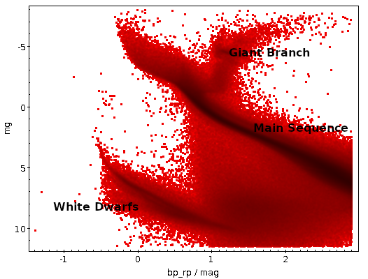

# FINAL REPORT

## HR Diagram



> Explain in a few sentences what each part is.

 - Giant Branch
   - Consists of red giant and supergiant stars. These stars have a lower surface temperature and high luminosity compared to main sequence stars. Stars found in this area include Anteres and Betelguese. These stars are near the end of their lives.
 - Main Sequence
   - This is the area where stars spend the majority of their young lives. It includes stars like our sun, Sirius, and Regulus.
 - White Dwarfs
   - This is where smaller and medium sized stars end up at the end of their lives. White Dwarf stars are hot, with low luminosity.

> What are some differences you see between your plot and the plot in this article?

Some differences between my plot and the article include:
 - Our data is cut off at bp-rp = 3.
 - Our plot doesn't show lower absolute magnitudes.
 - Our plot appears to have more stars between the main sequence and White Drawf areas.
 - The "unstable" area includes more stars in our plot.

> How do you think these differences are explained?

The article's plot is from the second release, so is a bit older than our data.
Additionally, Gaia's plot uses data from nearly four times as many stars. Our
query can also explain some of the differences; we are only considering closer,
bluer stars.

> Known sources will be easy. Record the following information you find from the GAIA
> table and on Simbad in the project spreadsheet: 


From [SIMBAD](http://simbad.u-strasbg.fr/simbad/sim-coo?Coord=236.97684844661572+24.344686959296244&CooFrame=FK5&CooEpoch=2000&CooEqui=2000&CooDefinedFrames=none&Radius=2&Radius.unit=arcmin&submit=submit+query&CoordList=):

```

Ton 249 -- White Dwarf
Distance to the center arcsec:	1.30
Other object types:	* (UCAC4,USNO,...), WD* (1986ApJS,WD), PM* (2012yCat), IR (2MASS), blu (Ton), UV (PG)
ICRS coord. (ep=J2000) :	15 47 54.5058110112 +24 20 39.889788774 (Optical) [ 0.0212 0.0324 90 ] A 2018yCat.1345....0G
FK4 coord. (ep=B1950 eq=1950) :	15 45 46.2824183261 +24 29 46.815345293 [ 0.0212 0.0324 90 ]
Gal coord. (ep=J2000) :	039.1071308964278 +50.3617766820534 [ 0.0212 0.0324 90 ]
Proper motions mas/yr :	-53.116 61.455 [0.067 0.072 90] A 2018yCat.1345....0G
Parallaxes (mas):	15.9279 [0.0471] A 2018yCat.1345....0G
Spectral type:	DB4 D 1986ApJS...61..305G
Fluxes (11) :	
B 15.5 [~] E 2003AJ....125..984M
R 16.35 [0.12] E 2012yCat.1322....0Z
G 15.8174 [0.0007] C 2018yCat.1345....0G
J 15.91 [0.09] C 2003yCat.2246....0C
H 15.89 [0.18] D 2003yCat.2246....0C
K 15.78 [0.22] D 2003yCat.2246....0C
u (AB) 15.704 [0.005] C 2015ApJS..219...12A
g (AB) 15.682 [0.004] C 2015ApJS..219...12A
r (AB) 15.941 [0.004] C 2015ApJS..219...12A
i (AB) 16.137 [0.005] C 2015ApJS..219...12A
z (AB) 16.372 [0.008] C 2015ApJS..219...12A

```

Possible variable stars include:

[Gaia-DR2-271235813332878848]([Gaia-DR2-271235813332878848.png)

[Gaia-DR2-3080844435869554176](Gaia-DR2-3080844435869554176.png)

[Gaia-DR2-404335952186690304](Gaia-DR2-404335952186690304.png)

[Gaia-DR2-4690619477160130944](Gaia-DR2-4690619477160130944.png)

[Gaia-DR2-6022729907881436544](Gaia-DR2-6022729907881436544.png)

[PG-1129+373](PG-1129+373.png)